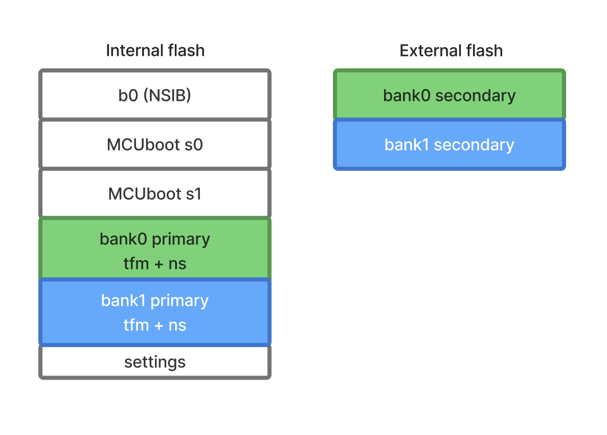
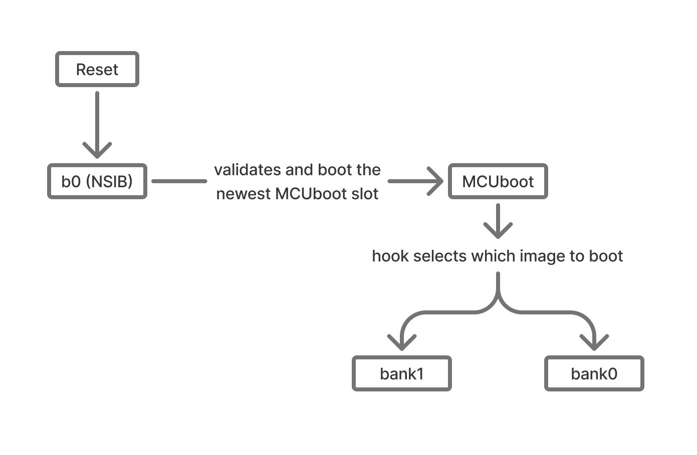

# nRF9151 Bank0/Bank1 Architecture

This repository is an experiment and reference implementation of a multi-image firmware
architecture on the **nRF9151**, exploring the full secure boot chain: an immutable
first-stage bootloader (NSIB/b0), an upgradable MCUboot with dual slots (s0/s1), and
two independently upgradable application images: a main image (bank1) and
a recovery image (bank0).

The goal is to validate this architecture for production firmware:
understanding the memory constraints, the boot flow, and the FOTA update paths for each
image in the chain.

## Overview

The firmware targets the **nRF9151** and is split into four images, all residing in the
device's 1 MB internal flash.

The flash layout:

The boot chain is:

---

## Images

### b0 (NSIB) — First-stage bootloader

Immutable bootloader stored in the first flash slot. Validates the newest
MCUboot image signature before handing over execution. Shall not be updated
in the field (write-protected via fprotect).

### MCUboot — Second-stage bootloader

Selects and validates either bank1 or bank0 before jumping to the
chosen image. Includes:

- Logging
- Serial recovery (DFU over UART)
- MCU Hooks for bank selection logic

### bank1 — Main application

The main application image: LwM2M client, sensors, GNSS, and FOTA. Includes:

- Logging
- nRF Modem Library
- LTE Link Control
- LwM2M stack
- LwM2M client utils
- FOTA download
- MCUmgr (DFU in app)
- GNSS
- I2C sensor subsystem: STTS22H (temperature), LSM303AGR (ecompass)
- SPI
- Settings / NVS

### bank0 — Recovery application

bank0 acts as a recovery image: if bank1 is non-functional or needs to be replaced,
bank0 can connect to the network and trigger a FOTA update to upgrade bank1. It is also
intended to eventually support upgrading MCUboot and itself (bank0), covering the full
firmware chain from a recovery state.
The image includes:

- Logging
- nRF Modem Library
- LTE Link Control
- LwM2M stack
- LwM2M client utils
- FOTA download
- Settings / NVS

> Both bank1 and bank0 embed their own TF-M instance, which configures the SPU
> (Security Processing Unit) before launching the non-secure application.

---

## Memory Usage

### ROM (Flash)

The nRF9151 provides **1 024 KB** of internal flash. The table below shows current
consumption per image slot and the remaining margin available for future development.

| Image          | Slot   | Used   | Free   |
|----------------|--------|--------|--------|
| b0 (NSIB)      | 32 KB  | 27 KB  |  5 KB  |
| MCUboot (s0)   | 52 KB  | 48 KB  |  4 KB  |
| MCUboot (s1)   | 52 KB  | 48 KB  |  4 KB  |
| bank1 — TF-M   | 31 KB  | 10 KB  | 21 KB  |
| bank1 — NS app | 288 KB | 271 KB | 17 KB  |
| bank0 — TF-M   | 31 KB  | 10 KB  | 21 KB  |
| bank0 — NS app | 240 KB | 233 KB |  7 KB  |
| Settings / NVS | 32 KB  | —      | —      |
| Unused region  | 240 KB | —      | 240 KB |

The bank0 NS app has 7 KB free, bank1 NS app 17 KB, and MCUboot 4 KB. The TF-M slots
both have 21 KB free. The 240 KB unused region is available to extend any of these
slots as needed, alongside a dedicated 32 KB settings partition.
The secondary slots for bank0 and bank1 upgrade images are stored on external flash.
