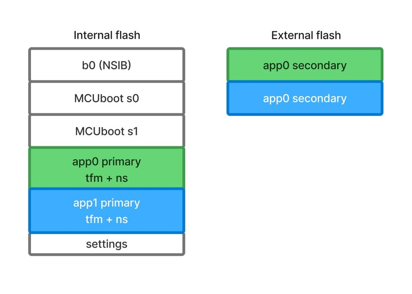
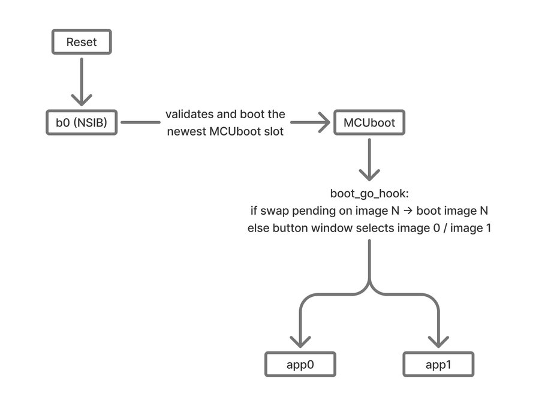

# nrf-multi-image-fota

This project is for testing and demonstrating multi-image firmware
architecture on the nRF9151 with LwM2M FOTA, built on the nRF Connect SDK

## Overview

Two independently upgradable non-secure application images (`app0` and `app1`)
lives behind a two-stage bootloader: NSIB (b0) as the immutable first stage
and MCUboot as the upgradable second stage. Each application have its own
TF-M instance and is signed as a distinct MCUboot image pair. A LwM2M client
in each application exposes the Advanced Firmware Update object (ID 33629)
with one instance per updatable component: `app0`, `app1`, and the modem
firmware. At boot, MCUboot invokes a custom hook that either run a pending
swap or opens a button-press window to let the user pick which image to
run.

This project demonstrates:

- Two-stage secure boot: b0 + MCUboot + dual signed app images
- TF-M embedded inside both `app0` and `app1` (both built for the `/ns` target)
- LwM2M FOTA of `app0`, `app1`, and modem firmware through a single LwM2M
  client, selecting the MCUboot image pair per update
- A forked `sdk-nrf` (`savosaicic/sdk-nrf`, branch `lwm2m-fota-multi-image-support`)
  with `fota_download` / `lwm2m_client_utils` extended to replace the hardcoded `img_num=0`
- A sysbuild time patch of the generated `pm_config.h` so the TF-M child
  build of `app1` links for its own partition addresses
- An MCUboot image selection hook that chooses between `app0` and `app1` on
  cold boot

Target board: `nrf9151dk/nrf9151/ns`. External flash: `gd25wb256` on the
DK, used for both MCUboot secondary slots.

## Repository structure

```
nrf-multi-image-fota/
  app0/                                Non-secure application image 0
    boards/                            DT overlay for external flash
    include/
    src/main.c                         LwM2M client bring up
    src/firmware_update.c              Registers /33629 instances, confirms slot
  app1/                                Non-secure application image 1
    boards/
    include/
    src/main.c
    src/firmware_update.c
    CMakeLists.txt                     app1 has its own CMake (built as external
                                       Zephyr project under sysbuild)
    prj.conf
  mcuboot_hooks/                       Zephyr module injected in MCUboot build
    src/boot_hooks.c                   pending swap check + button window
    zephyr/module.yml
    CMakeLists.txt
  sysbuild/
    mcuboot.conf                       Kconfig fragment (hooks, ext flash)
    mcuboot.overlay                    DT overlay for external flash
  CMakeLists.txt                       Top-level (app0)
  prj.conf                             app0 Kconfig fragment
  sysbuild.cmake                       Multi-image orchestrator, pm_config.h patch
  sysbuild.conf                        Sysbuild Kconfig fragment
  pm_static_nrf9151dk_nrf9151_ns.yml   Static partition map
  west.yml
```

## Architecture

### Flash layout



Partition definitions live in `pm_static_nrf9151dk_nrf9151_ns.yml`.

### Boot chain



### TF-M in both images

Both `app0` and `app1` are `/ns` targets, so each one builds its own TF-M as
a child ExternalProject.

After the Partition Manager resolves the static layout, it generates a
`pm_config.h` header for each image. This header exposes every partition in
the domain as a set of C preprocessor defines, for example:

```c
#define PM_TFM_ADDRESS      0x28200
#define PM_TFM_SIZE         0x7e00
#define PM_APP_ADDRESS      0x30000
#define PM_APP_SIZE         0x38000
```

These defines are the bridge between the flash layout and the firmware:
TF-M, MCUboot, and the application all include `pm_config.h` to know where
they and their neighbours live in flash and SRAM.

A plain PM static file is not enough to support two TF-M builds in one
domain. TF-M's `region_defs.h` and `flash_layout.h` reference fixed define
names regardless of which image is being built:

```c
#define S_CODE_START  (PM_TFM_OFFSET)   /* always "tfm" partition */
#define NS_CODE_START (PM_APP_OFFSET)   /* always "app" partition */
```

The Partition Manager derives define names directly from partition names:
a partition called `app1_tfm` produces `PM_APP1_TFM_ADDRESS`, which TF-M
never reads.

At the same time, the PM static file cannot contain two partitions named
`tfm`. `PM_TFM_ADDRESS` always resolves to `app0`'s TF-M address.
Furthermore, all images in the APP domain share the same set
of partition defines in their `pm_config.h`. There is no per-image
isolation at the PM level, so there is no way to make `PM_TFM_ADDRESS`
mean different things for `app0` and `app1` through the PM static file
alone.

The static PM file cannot contain two partitions named `tfm`. Consequently,
`PM_TFM_ADDRESS` always resolves to the TF-M address of `app0`.
Moreover, all images within the APP domain share an identical set of
partition defines in their pm_config.h. The PM provides no per-image
isolation; therefore, `PM_TFM_ADDRESS` cannot map to different addresses
for `app0` versus `app1` using the PM static file alone.

The workaround is implemented in `sysbuild.cmake`. It uses
`cmake_language(DEFER)` to append `#undef` / `#define` overrides to `app1`'s
`pm_config.h` after the Partition Manager generates it. The override block
redirects some important TF-M define (`PM_TFM_*`, `PM_APP_*`, `PM_MCUBOOT_PAD_*`,
`PM_MCUBOOT_PRIMARY_*`, `PM_APP_IMAGE_*`) to `app1`'s slot addresses,
breaking the coupling with `app0`.
`PM_MCUBOOT_SECONDARY_*` is intentionally not overridden: `dfu_target_mcuboot`
uses `PM_MCUBOOT_SECONDARY_0_*` aliases that must resolve to the `app0` staging
slot so that downloads with `img_num=0` target the correct external-flash
region.

If the PM static layout in `pm_static_nrf9151dk_nrf9151_ns.yml` changes,
the hardcoded addresses inside `_patch_app1_pm_config()` in
`sysbuild.cmake` must be updated to match.

## SDK fork

Upstream `fota_download` hardcodes `img_num=0` in every call to
`dfu_target_init()`, and `lwm2m_client_utils` hardcodes a single
"application" instance pointing at `PM_MCUBOOT_PRIMARY_ID`.
The fork fixes both to enable multi-image FOTA. `west.yml` points directly to this
fork, so no manual patch step is needed.

Both applications use the new API:

```c
lwm2m_adv_firmware_mcuboot_inst_add("app0", 0);
lwm2m_adv_firmware_mcuboot_inst_add("app1", 1);
lwm2m_init_firmware_cb(fota_event_cb);
lwm2m_init_image_multi(<running image index>);
```

The running image index is hardcoded per binary (`APP_MCUBOOT_IMG_NUM`
in each app's `firmware_update.c`). No SDK runtime mechanism exposes
it: `CONFIG_MCUBOOT_APPLICATION_IMAGE_NUMBER` is always 0 for
application images, and `BLINFO_RUNNING_SLOT` records the slot
(primary/secondary) the image was loaded from, not the image pair
index, in swap mode every image runs from primary (slot 0).

A future runtime mechanism could let the custom MCUboot hook (which
already knows `image_index`) write it to retained memory and have the
application read it back via `retention_read()`.

## Building

Set up the west workspace:

```
mkdir nrf-multi-image-fota-ws && cd nrf-multi-image-fota-ws
python3 -m venv .venv
source .venv/bin/activate
pip install west
west init -m https://github.com/savosaicic/nrf-multi-image-fota --mr main
west update
pip install -r zephyr/scripts/requirements.txt
```

Set the LwM2M server host in `prj.conf` (both images) before building:
 
```
CONFIG_LWM2M_CLIENT_UTILS_SERVER="coap://<lwm2m-server-host>:5683"
```

Build both images, MCUboot, and NSIB through sysbuild:

```
west build -b nrf9151dk/nrf9151/ns --sysbuild nrf-multi-image-fota
```

Sysbuild registers `app1` as an external Zephyr project (see
`sysbuild.cmake`), adds it to the Partition Manager app list, forces
`CONFIG_BOOTLOADER_MCUBOOT=y` for signing, and propagates the signing key
path. The MCUboot hook module is injected via
`mcuboot_EXTRA_ZEPHYR_MODULES`. The `pm_config.h` override for `app1` is
applied automatically during the sysbuild CMake run.

## Flashing

Flash the combined image:

```
west flash
```

## Boot behavior

`boot_go_hook` in `mcuboot_hooks/src/boot_hooks.c` runs at the top of
MCUboot main() (enabled by `CONFIG_BOOT_GO_HOOKS=y` and
`CONFIG_BOOT_IMAGE_ACCESS_HOOKS=y` in `sysbuild/mcuboot.conf`). It fully
replaces MCUboot's built-in image selection:

1. For each image pair, call `boot_swap_type_multi(i)`. If any returns
   `BOOT_SWAP_TYPE_TEST`, `BOOT_SWAP_TYPE_PERM`, or `BOOT_SWAP_TYPE_REVERT`,
   boot that image immediately. This lets a FOTA-scheduled reboot actually
   install the new firmware regardless of which image was previously
   running.
2. Otherwise, print a 5 second countdown and poll `sw0` and `sw1`:
   - `sw0` (BTN1) -> boot `app0` (image pair 0)
   - `sw1` (BTN2) -> boot `app1` (image pair 1)
3. On timeout, boot `app0` by default.

The hook calls `boot_go_for_image_id()` with the chosen image index and
returns its result as the MCUboot boot response.

## LwM2M FOTA

Each application registers MCUboot image pairs with the Advanced Firmware
Update object before `lwm2m_init_firmware_cb()` creates the instances.
`lwm2m_adv_firmware_mcuboot_inst_add(name, img_num)` binds an
LwM2M object instance to an explicit MCUboot image pair.

```c
lwm2m_adv_firmware_mcuboot_inst_add("app0", 0);
lwm2m_adv_firmware_mcuboot_inst_add("app1", 1);
```

The modem instance is added internally by `lwm2m_client_utils`
(`"modem:..."`). The resulting LwM2M tree is:

| Object path | Component name      | Target               |
|-------------|---------------------|----------------------|
| `/33629/0`  | `app0`              | MCUboot image pair 0 |
| `/33629/1`  | `app1`              | MCUboot image pair 1 |
| `/33629/2`  | `modem:nRF91__ ...` | Modem firmware       |

Triggering an update from the LwM2M server:

1. Write the firmware URL to the Package URI resource of the relevant
   instance.
2. The client downloads the image, writes it to the corresponding MCUboot
   secondary slot (or to the modem), and reports state
   transitions on the State resource.
3. Execute Update on the Update resource (`/33629/<inst>/2`). The client
   schedules the swap (`dfu_target_schedule_update(img_num)`) and reboots.
4. On reboot, the MCUboot hook detects the pending swap, boots the target
   image, performs the swap, and the new image confirms itself via
   `lwm2m_init_image_multi()`.
